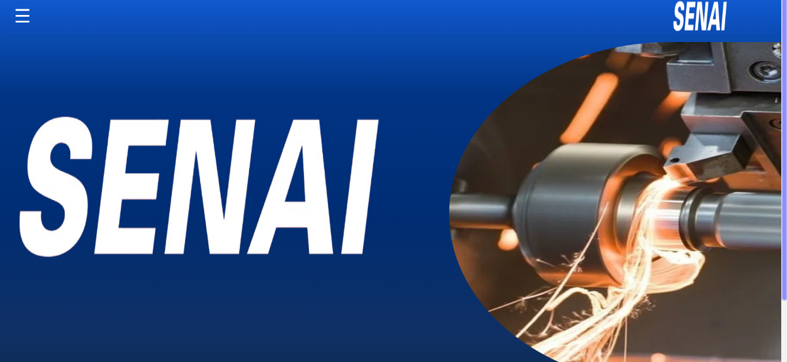

# 
Historico de Manutenção SENAI 564 (Fixcare)

## 💻 Seja muito bem-vindo!
#### Esta documentação fornecerá informações abrangentes sobre como usar o nosso software e apresentará o nosso projeto em detalhes.

### O que é?

Esse software de código aberto  utiliza  uma API criada pelos alunos para documentar as manutenções nos equipamentos utilizados pelas turmas que utilizam  a oficina de mecânica do SENAI 564 Valinhos.

### Começando.
Para começar a utilizar esse software e entender melhor o projeto, siga os passos abaixo:

1. Em seu projeto, utilize o comando "npm i" no terminal para fazer a instalação de todas as bibliotecas utilizadas no projeto.
2. Em seguida, utileze o comando "npm run dev" no terminal para poder abri-lo em seu navegadro.

## Esquema de classes:
| ATRIBUTO      | TIPO     | DESCRIÇÃO                                |
|---------------|----------|------------------------------------------|
| question            | string   | Pergunta principal                                |
| category          | string   | Definem a categoria da pergunta                             |
| difficulty         | string   | Define a dificuldade da pergunta                           |
| response1         | string   | Primeira alternativa  
| response2         | string   | Segunda alternativa  
| response3        | string   | Terceira alternativa 
| response4         | string   | Quarta alternativa
| correct         | string   | Opção de alternativa correta 

## Boas práticas em nosso código:

Clean code: Estruturação de pastas organizada, dentação de código, versionamento de branchs.

Componentização: Utilizada nos elementos: Cards da página de regras, Footer, Header, Input members, Member, Navegação por imagem, PopUp e SubContainers da index.

## Regras de negócio

| Regra | Descrição                                            |
|-------|------------------------------------------------------|
| Regra 1 | Não pode existir campos vazios em envios de formulários. |
| Regra 2 | O tamanho mínimo para cadastrar um membro é de 3 caracteres. |
| Regra 3 | Idade para cadastrar membro entre 15-100 anos.       |
| Regra 4 | Verificação de URL de imagens.                       |                                       |
| Regra 5 | Verificação de URL com caracteres especiais. |
| Regra 6 | Verificação de e-mail na página de contato. |
| Regra 7 | Verificação da contabilidade de erros       |
| Regra 8 | Verificação de perguntas cadastradas.                      |

## Documentação de cores oficiais do site

| Cores Degrade             | Hexadecimal                                                |
| ----------------- | ---------------------------------------------------------------- |
| Cor Vermelha 1       |  #FF0000 |
| Cor  Vermelha 2      |  #BC0303 |
| Cor Vermelha 3       |  #750202 |

| Cor               | Hexadecimal                                                |
| ----------------- | ---------------------------------------------------------------- |
| Cor Branca       |  #F1F1F19A |
| Cor Vermelho Rosa     |  #FD1F1F66 |
| Cor Vermelho Claro 1       |  #FF000099 |
| Cor Vermelho Escuro     |  #71000087 |
| Cor Vermelho Claro 2     |  #BC0303 |

# Equipe

Somos um grupo de estudantes que estão no quarto semestre do curso técnico de desenvolvimento de sistemas no SENAI de Valinhos, e gostaríamos de compartilhar o nosso TCC que criamos com base no que aprendemos até agora. Nosso objetivo com esta documentação é mostrar como aplicamos as habilidades que adquirimos no SENAI para solucionar problemas e criar, além de solucionarmos um problema recorrente no SENAI, a falta de documentação das manutenções e lubrificações dos equipamentos na área da oficina de mecânica. Atualmente, o projeto é focado no equipamento torno.

### Entre em contato conosco pelo GitHub!

#### - Richard Macedo

                                                    
#### - Luana Fassini
                         

#### - Guilherme Lima

#### - Guilherme Sachinelli

#### - Isabelle Barquilia

## Feedback

Se você tiver algum feedback, por favor nos deixe saber por meio destes email's:
1. guilhermelima@aluno.senai.br,
2. guilherme.sachinelli@aluno.senai.br,
3. richard.siqueira@aluno.senai.br,
4. luana-fassini@aluno.senai.br,
5. isabelle-moraes@aluno.senai.br.
